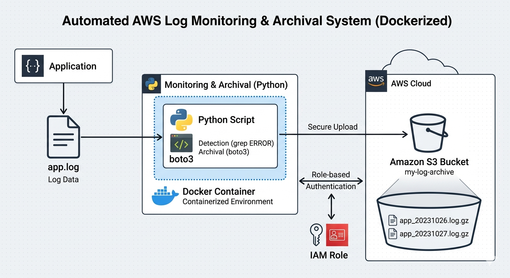
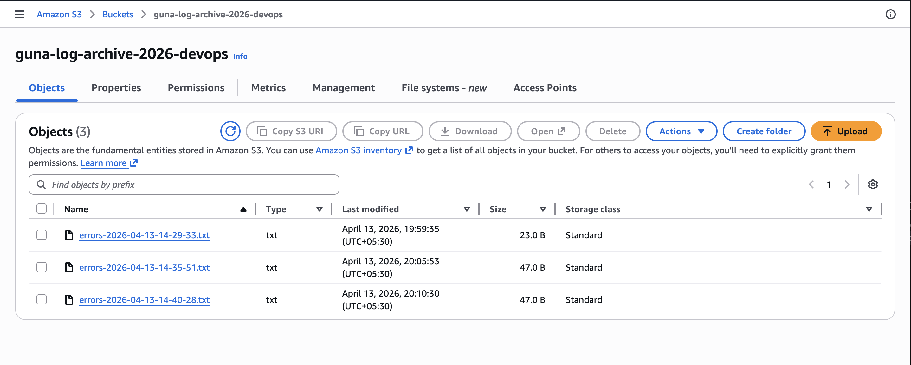

# 📊 AWS Log Monitoring & Archival System (Dockerized)

**Status:** Production Ready | **CI:** GitHub Actions

---

## 📌 Project Overview

> **The Why:** In distributed cloud environments, critical error signals often get buried in ephemeral log streams. Waiting for a developer to SSH into a server to `grep` for errors is a reactive, manual, and unscalable approach.

This project implements a **proactive, event-driven observability pipeline**. It automatically extracts `ERROR` severity events from application logs on an EC2 instance and persists them in a durable, immutable Amazon S3 archive. The solution is designed with a **"cattle, not pets"** philosophy—leveraging IAM Roles for identity and Docker/Cron for portability and reliability.

---

## 🏗️ Architecture & Data Flow

The system follows a clean **Extract, Transform, Load (ETL)** pattern optimized for lightweight edge compute (EC2).



| Stage | Component | Description |
| :--- | :--- | :--- |
| **1. Ingestion** | `app.log` (Local FS) | Raw text log file generated by the host application. |
| **2. Processing** | **Python Runtime** | Custom script (`monitor.py`) performs real-time regex filtering. |
| **3. Packaging** | **Docker Engine** | Ensures environment parity and dependency isolation (`boto3`). |
| **4. Authentication** | **IAM Instance Role** | **Zero hard-coded secrets.** The EC2 metadata service provides temporary credentials. |
| **5. Storage** | **Amazon S3** | Durable object storage for long-term audit and forensic analysis. |
| **6. Orchestration** | **Cron** | Reliable, OS-level time-based scheduler for hourly execution. |

---

## 🛠️ Tech Stack

| Category | Technology | Purpose |
| :--- | :--- | :--- |
| **Cloud Compute** | AWS EC2 (Amazon Linux) | Host environment for log generation & agent. |
| **Storage** | AWS S3 | Immutable backup of error artifacts. |
| **Security** | AWS IAM Roles | Secure, temporary credential distribution. |
| **Language** | Python 3 | Core processing logic & AWS SDK integration. |
| **Container** | Docker | Runtime consistency & dependency management. |
| **Scheduler** | Cron | Native Linux automation. |
| **CI/CD** | GitHub Actions | Automated build validation on every `push`. |

---

## 🚀 Detailed Setup & Operations

Follow these instructions to replicate the pipeline in your AWS environment.

### 🔒 Prerequisites & Security Configuration

1.  **IAM Role Attachment:** Ensure your EC2 instance has an IAM Role attached with **Write** permissions to your target S3 bucket.
    - *Policy Snippet:* `s3:PutObject` on `arn:aws:s3:::your-bucket-name/*`
    - *Security Note:* We explicitly **do not** use `aws configure` or local `~/.aws/credentials` files in this solution.

2.  **Environment Variable:** The only configuration required is the target bucket name.
    ```bash
    export S3_BUCKET=your-company-log-archive
    ```

### 🐍 Manual Execution (Bare Metal)

Use this for initial testing and debugging.

```bash
# 1. Install the AWS SDK for Python
pip3 install boto3

# 2. Execute the script
python3 monitor.py

# Expected STDOUT:
# > Uploaded error logs to S3: errors_20231027T140000.log
```

### 🐳 Docker Execution (Recommended)

This method ensures the script runs identically on a developer laptop, a build server, or an EC2 instance.

```bash
# 1. Build the immutable image
docker build -t log-monitor:latest .

# 2. Run the container
# -v Mounts the current log file into the container's expected path
# -e Passes the bucket name environment variable
# --rm Cleans up the container after execution
docker run --rm \
  -v $(pwd)/app.log:/app/app.log:ro \
  -e S3_BUCKET=$S3_BUCKET \
  log-monitor:latest
```

### ⏳ Automated Scheduling with Cron

To achieve true "hands-free" operations, configure the system scheduler.

```bash
# 1. Open the crontab editor for the current user (ec2-user)
crontab -e

# 2. Insert the following line to run the Python script hourly at minute 0
0 * * * * /usr/bin/python3 /home/ec2-user/aws-log-monitoring-project/monitor.py

# 3. Verify the cron job is registered
crontab -l
```

---

## 🧠 Script Logic Breakdown (`monitor.py`)

The core intelligence of the pipeline resides in this lightweight Python script:

1.  **Log Parsing:** Opens `app.log` in read mode.
2.  **Filtering:** Uses a `for` loop and string containment (`if "ERROR" in line`) to identify critical entries efficiently without loading the entire file into memory (if using generators, scalable to GB-size logs).
3.  **Timestamp Generation:** Constructs a unique ISO 8601 timestamp to prevent object overwrites in S3 (`f"errors_{datetime.now().isoformat()}.log"`).
4.  **S3 Upload:** Utilizes `boto3.client('s3').put_object()`.
5.  **Identity Resolution:** Boto3 automatically checks the **Instance Metadata Service (IMDS)** for IAM Role credentials. **No keys are present in the code or environment.**

---

## 🛡️ Security Best Practices & Compliance

This project is architected with enterprise security standards in mind:

- **Principle of Least Privilege:** The IAM Role grants **only** `s3:PutObject` access; it cannot read, delete, or modify other S3 resources.
- **No Long-Lived Secrets:** Eliminates the risk of compromised `AWS_ACCESS_KEY_ID` variables.
- **Immutable Infrastructure:** The Docker image is built and versioned. No manual changes are made to running containers.
- **Secure Local Storage:** `.gitignore` is configured to exclude:
    - `*.log` (Prevents accidental upload of real data to GitHub)
    - `__pycache__/`
    - `*.pyc`
    - Environment variable files (`.env`)

---

## ✅ Validation & Verification

Evidence of successful automated archival to Amazon S3.



---

## 📂 Project Structure

```
aws-log-monitoring-project/
├── .github/workflows/      # CI/CD Validation (Docker Build Test)
│   └── docker-build.yml
├── images/                 # Documentation Assets
│   ├── architecture.drawio.png
│   └── s3-upload-proof.png
├── monitor.py              # Core Python ETL Logic
├── Dockerfile              # Container Build Spec
├── app.log                 # Sample / Active Log File (Local only)
├── .gitignore              # Security Exclusion Rules
└── README.md               # This Document
```

---

*Author Note: This project showcases production-grade DevOps practices including Infrastructure as Code (IAM), containerization, observability, and automated CI validation using GitHub Actions.*
```